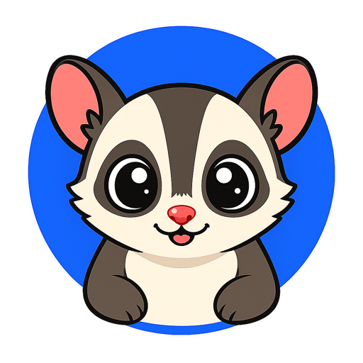

<p align="center">
  
</p>

<h1 align="center">OpenMission</h1>

<h3 align="center">Built. Tested. Proven.</h3>

<p align="center">
  <a href="#why-openmission">Why OpenMission?</a> &bull;
  <a href="#-get-started">Get Started</a> &bull;
  <a href="#-how-it-works">How It Works</a> &bull;
  <a href="#-requirements">Requirements</a> &bull;
  <a href="#-data-and-operations">Operations</a> &bull;
  <a href="#-troubleshooting">Troubleshooting</a>
</p>

<p align="center">
  
  
  
  
  <a href="LICENSE"></a>
</p>

<p align="center">
  <strong>AI coding tools expect an engineer. OpenMission starts with your idea.</strong><br>
  OpenMission uses open models on your hardware to plan, build, and
  browser-test the application.<br>
  No metered API tokens. No software-delivery process to master.
</p>

> **Early access:** This is the public, source-free Docker deployment for
> OpenMission. It contains no application source and performs no local image
> builds. Public application source and OpenMission Cloud are planned for
> future releases.

## Why OpenMission?

| Typical AI code generation | OpenMission |
| --- | --- |
| Starts coding from a prompt | Establishes a reviewable Story and acceptance criteria |
| Produces code and declares completion | Runs controller-owned browser validation |
| Leaves the user to determine what works | Records `PASS`, `FAIL`, and evidence by criterion |
| Delivers an opaque result | Preserves the application source, tests, screenshots, and evidence |
| Depends on a hosted model workflow | Runs with user-selected local Ollama models |

- **Acceptance-led:** intent becomes a product contract before implementation.
- **Browser-proven:** requirements are exercised through the visible interface.
- **Locally owned:** generated source, tests, and evidence remain on your machine.
- **Model-flexible:** Thinking and Coding models can be selected globally or per
  project.

## ⚡ Get Started

Install these prerequisites first:

- [Docker with Docker Compose](https://docs.docker.com/get-started/get-docker/)
- [Ollama](https://ollama.com/download)

Pull the default local models:

```bash
ollama pull hermes3:8b
ollama pull qwen3-coder:30b
```

Clone the immutable RC8 deployment and start OpenMission:

```bash
git clone --branch v0.1.0-rc.8 --depth 1 \
  https://github.com/CharlieKuharski/openmission-deploy.git openmission

cd openmission
cp .env.example .env
docker compose --env-file .env pull
docker compose --env-file .env up -d --wait
```

Open [http://127.0.0.1:15173](http://127.0.0.1:15173).

On first startup, OpenMission opens the Utility screen so you can verify the
Ollama connection, pull other models by name, and choose the global Thinking
and Coding defaults. Compose pulls and starts the complete configured stack;
no OpenMission source checkout or local image build is required.

## ✨ How It Works

```text
Describe your idea
→ review the Story
→ approve the acceptance criteria
→ watch OpenMission build and test
→ launch your application
```

OpenMission handles the delivery loop:

- **Story and acceptance criteria:** translates the prompt into a reviewable
  product contract before coding begins.
- **Application generation:** produces a runnable application and gives you
  its source.
- **Browser validation:** tests each acceptance criterion through Playwright
  and records the result.
- **Project evidence:** preserves generated tests, screenshots, and validation
  evidence with the project.
- **Local models:** uses Ollama on your machine for Thinking and Coding work.

The Compose stack pulls these OpenMission images:

- [OpenMission API](https://hub.docker.com/r/charliekuharski/openmission)
- [OpenMission UI](https://hub.docker.com/r/charliekuharski/openmission-ui)
- [OpenMission Hermes](https://hub.docker.com/r/charliekuharski/openmission-hermes)

Browserless, Playwright MCP, and SearXNG are included as supporting services.

## 🖥️ Requirements

| Platform | Status |
| --- | --- |
| macOS on Apple Silicon with Docker Desktop | Validated |
| Linux AMD64 with Docker Engine and Compose | Validated |
| Linux ARM64 | Published images |
| Windows and WSL2 | **Validation pending** |

OpenMission runs Ollama directly on the host so local models can use the host's
GPU acceleration. The 30B coding model needs substantial memory. A practical
reference system is:

```text
Mac with Apple M4 Pro
48 GB unified memory
1 TB SSD
Docker Desktop
Ollama running on macOS
```

Machines with less memory can use smaller models selected from the Utility
screen. Model size affects generation quality, speed, and available memory for
Docker builds and browser validation.

## 💾 Data and Operations

OpenMission keeps its primary data beside the deployment:

- `./workspace` contains generated applications, source, tests, and evidence.
- `./data` contains the OpenMission SQLite database.
- `openmission-hermes-data` is a Compose-managed Hermes runtime volume.

Check service health:

```bash
docker compose --env-file .env ps
curl -f http://127.0.0.1:18080/api/health
```

Restart without deleting data:

```bash
docker compose --env-file .env restart
```

Stop OpenMission while preserving data:

```bash
docker compose --env-file .env down
```

Back up the primary project data after stopping OpenMission:

```bash
tar -czf "openmission-backup-$(date +%Y%m%d).tar.gz" workspace data
```

Do not use `docker compose down --volumes` unless you intend to remove the
Hermes runtime volume. Do not delete `workspace` or `data` unless you intend to
remove generated projects or OpenMission state.

### Update

Deployment releases are immutable and match the Docker image version. To move
to a newer tested release:

```bash
NEW_VERSION=0.1.0-rc.8

git fetch --tags
git switch --detach "v${NEW_VERSION}"
sed -i.bak "s/^OPENMISSION_VERSION=.*/OPENMISSION_VERSION=${NEW_VERSION}/" .env
rm -f .env.bak
docker compose --env-file .env pull
docker compose --env-file .env up -d --wait
```

Set `NEW_VERSION` to the release you are installing and review its release
notes before updating.

## 🔒 Security

All published ports bind to `127.0.0.1` by default. The values supplied in
`.env.example` are local-only defaults. Replace every value ending in
`change-me` before remote access, reverse-proxy exposure, cloud deployment, or
use on a shared machine. Generate replacements with:

```bash
openssl rand -hex 32
```

The API and Hermes containers mount `/var/run/docker.sock` so OpenMission can
build and validate generated applications. Docker socket access is equivalent
to host-level administrative control. Run OpenMission only on a machine and
with container images you trust.

## 🛠️ Troubleshooting

Confirm Ollama is running and reachable on the host:

```bash
ollama list
curl -f http://127.0.0.1:11434/api/tags
```

Inspect service status and recent logs:

```bash
docker compose --env-file .env ps
docker compose --env-file .env logs --tail 100 api ui hermes-gateway
```

On macOS, keep this repository under a directory shared with Docker Desktop so
generated project bind mounts are available to Docker.

## 🚀 What's Next

**OpenMission Cloud is coming.** The managed version will be for users who want
OpenMission without operating Docker, Ollama, models, or local infrastructure.

Public availability of the OpenMission application source is also planned for
a future release. This deployment repository will continue to provide tested,
versioned Compose configurations for published OpenMission images.

## License and Brand

The OpenMission container distribution and deployment materials are available
under the [Apache License 2.0](LICENSE). The OpenMission name, logo, and
OpenMission Sugar Glider artwork are excluded from that license and remain
reserved brand assets. Truthful references such as "runs OpenMission" or
"compatible with OpenMission" are permitted when they do not imply endorsement
or official status.
